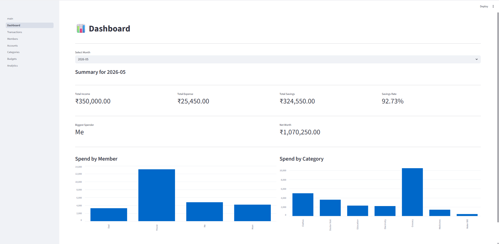
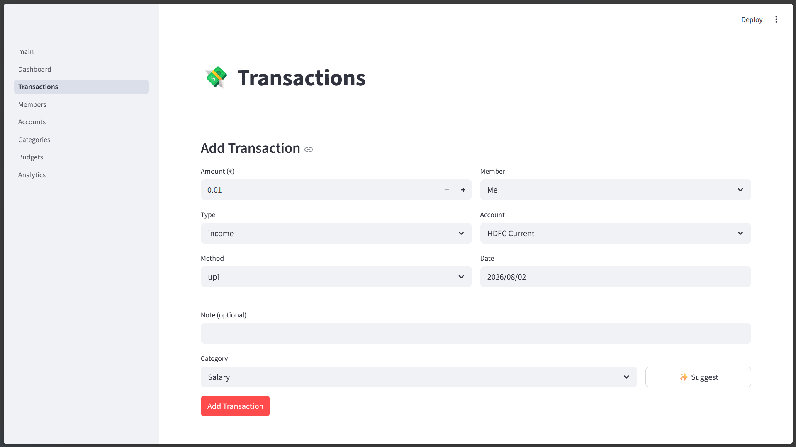
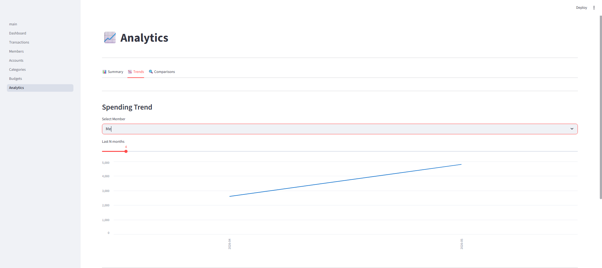
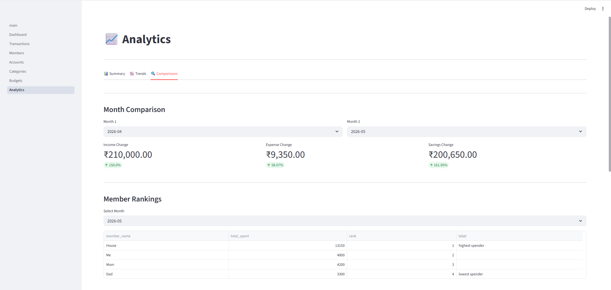
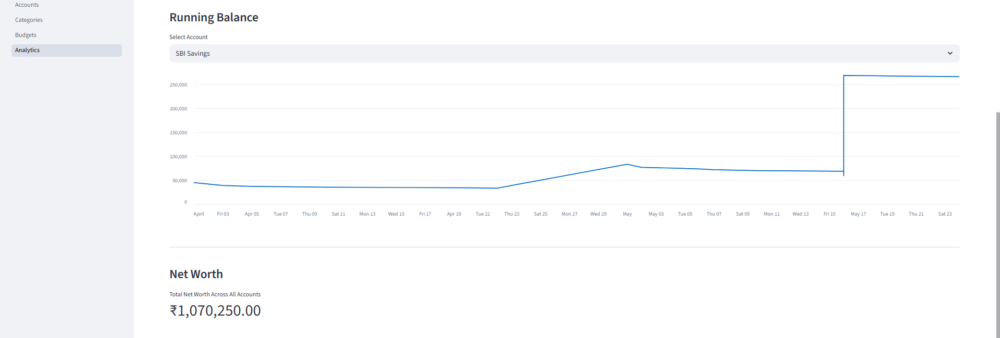

# Personal Finance Tracker

A web application for logging, managing, and visualizing personal and family finance records. Built with Python, PostgreSQL, and Streamlit — no spreadsheets, no manual formulas, no hassle.

> **Inspiration:** My father manages our family's monthly finances on Excel. I watched him spend hours on manual calculations, poorly structured data, and charts that broke every time a row was added. This project solves every problem he faced — structured data, instant analytics, and a clean interface anyone can use.

---


## Screenshots
## Application Screenshots

<details>
  <summary><strong> Dashboard </strong></summary>
  <br>
  
</details>

<details>
  <summary><strong>Transaction(add_transactions)</strong></summary>
  <br>
  
</details>

<details>
  <summary><strong>Transaction(view, edit, delete) and CSV ingestion</strong></summary>
  <br>
  
</details>

<details>
  <summary><strong>Analytics(spending-trend)</strong></summary>
  <br>
  
</details>

<details>
  <summary><strong>Analytics(month_comparison)</strong></summary>
  <br>
  
</details>

<details>
  <summary><strong>Analytics(running_balance)</strong></summary>
  <br>
  
</details>


---

## Features

- **Daily transaction logging** — add income, expense, and transfer transactions via a clean web form with dropdown validation for members, accounts, and categories
- **Bulk CSV ingestion** — import historical transactions in bulk using the provided CSV template; the app validates, resolves names to IDs, and updates account balances automatically
- **Member-wise tracking** — track spending per family member or shared virtual members (e.g. "House" for shared household expenses)
- **Multi-account support** — manage multiple bank accounts and wallets; balances update automatically on every transaction
- **Budget management** — set monthly budgets per member per category and track actual vs budgeted spending
- **Analytics dashboard** — monthly summaries, spending trends, member/category breakdowns, running account balances, month comparisons, and spend averages — all without writing a single formula
- **Full CRUD** — add, view, edit, and delete transactions, members, accounts, categories, and budgets directly from the app

---

## Tech Stack

| Layer | Technology | Reason |
|---|---|---|
| Database | PostgreSQL | Open source, industry grade, excellent for structured financial data, runs efficiently even on low-end hardware |
| Data layer | Python + psycopg2 | Direct SQL control, no ORM overhead, full transparency of every query |
| Analytics | pandas | Powerful aggregation on top of query results without rewriting SQL |
| Web app | Streamlit | Removes frontend complexity, purpose-built for data science workloads, clean UI out of the box |
| Environment | WSL2 Ubuntu | Linux tooling on Windows, PostgreSQL runs natively |

**Why psycopg2 over SQLAlchemy:** SQLAlchemy's ORM abstracts away exactly what this project is meant to demonstrate — direct SQL query writing and database interaction. psycopg2 keeps every query explicit and readable.

**Why Streamlit over Flask:** The core value of this project is the analytics and finance management, not a flashy UI. Streamlit lets you build a functional, clean interface in pure Python without touching HTML, CSS, or JavaScript.

**Why PostgreSQL over SQLite:** PostgreSQL handles concurrent connections, enforces constraints properly, and mirrors what you would use in a production environment. It also connects natively to Power BI for dashboard integration (planned).

---

## Project Structure

```
finance-tracker/
├── app/                                     # Streamlit web application
│   ├── main.py                              # Entry point and home page
│   └── pages/
│       ├── 1_Dashboard.py                   # Monthly KPI cards and charts
│       ├── 2_Transactions.py                # Add, view, edit, delete, bulk import
│       ├── 3_Members.py                     # Manage family members
│       ├── 4_Accounts.py                    # Manage bank accounts and wallets
│       ├── 5_Categories.py                  # Manage expense/income categories
│       ├── 6_Budgets.py                     # Set and track monthly budgets
│       └── 7_Analytics.py                   # Full analytics workspace
├── assets/
│   ├── Analytics(month_comaparison).png
│   ├── Analytics(running_balance).png
│   ├── Analytics(spending_trend).png
│   ├── Dashboard.png
│   ├── Transaction(add_transaction).png
│   └── Transaction(view, edit, delete).png
├── data/
│   ├── Seed.py                              # Populates database with initial data
│   ├── transactions_template.csv            # CSV format reference
│   └── Transaction_sample.csv               # Sample data for testing
├── db/
│   ├── connection.py                        # psycopg2 connection via .env
│   └── schema.sql                           # All table definitions and seed members
├── src/
│   ├── queries.py                           # Full CRUD functions for all 5 tables
│   ├── ingest.py                            # Bulk CSV ingestion pipeline
│   ├── analytics.py                         # Business intelligence functions
│   └── calculations.py                      # Utility math and comparison functions
├── .env.example                             # Environment variable template
├── requirements.txt                         # Python dependencies
└── README.md
```

---

## Setup

### 1. Clone the repository

```bash
git clone https://github.com/Varun-Narwal/finance-tracker.git
cd finance-tracker
```

### 2. Create and activate a virtual environment

```bash
python -m venv venv
source venv/bin/activate        # Linux/macOS/WSL
venv\Scripts\activate           # Windows
```

### 3. Install dependencies

```bash
pip install -r requirements.txt
```

### 4. Configure environment variables

Copy `.env.example` to `.env` and fill in your PostgreSQL details:

```bash
cp .env.example .env
```

```env
DB_HOST=localhost       # PostgreSQL host, usually localhost
DB_PORT=5432            # Default PostgreSQL port
DB_NAME=finance_tracker # Name of your database
DB_USER=postgres        # Your PostgreSQL username
DB_PASSWORD=            # Your PostgreSQL password, leave empty if using trust auth
```

> Everything runs locally on your own machine. Your credentials never leave your system.

### 5. Create the database

```bash
psql -U postgres -c "CREATE DATABASE finance_tracker;"
```

### 6. Run the schema

```bash
psql -U postgres -d finance_tracker -f db/schema.sql
```

This creates all 5 tables (`members`, `accounts`, `categories`, `transactions`, `budgets`) with their relationships and seeds 4 default members: `Me`, `Dad`, `Mom`, and `House` (a virtual shared household member).

### 7. Seed accounts, categories, and budgets

```bash
python data/Seed.py
```

This populates sample accounts, a full category hierarchy (with subcategories), and monthly budgets for each member. Edit `Seed.py` to match your real accounts and family setup before running.

### 8. Run the app

```bash
streamlit run app/main.py
```

Open `http://localhost:8501` in your browser.

---

## CSV Ingestion

To bulk import historical transactions, use the provided template:

```
data/transactions_template.csv
```

Column format:
```
amount, transaction_type, method, member_name, account_name, to_account_name, category_name, note, transaction_date
```

- `transaction_type` — `income`, `expense`, or `transfer`
- `method` — `upi`, `cash`, `internet_banking`, or `cheque`
- `to_account_name` — only required for `transfer` type
- `category_name` — leave empty for `transfer` type
- `transaction_date` — format `YYYY-MM-DD`
- Member and account names must exactly match what is in your database

Upload the CSV from the Transactions page in the app and click **Run Ingestion**. The app validates each row, resolves names to database IDs, inserts all valid rows in a single batch, and updates account balances automatically. Skipped rows are reported with reasons.

---

## Database Schema

```
members ──────────────── accounts
   │                         │
   │              from/to    │
   └──── transactions ───────┘
              │
         categories (self-referential parent_id)
              │
           budgets
```

Key design decisions:
- `amount` is always positive — direction is determined by `type` (`income`, `expense`, `transfer`)
- `transfer` transactions use both `account_id` (source) and `target_account_id` (destination)
- Categories support a two-level hierarchy via self-referential `parent_id`
- The `House` member is a virtual member (`is_virtual = TRUE`) that absorbs all shared household expenses like groceries and electricity
- Account balances update atomically with each transaction — insert and balance update share a single database commit, so partial updates are impossible

---

## Roadmap

- [ ] **Power BI integration** — connect directly to PostgreSQL and build a dedicated financial dashboard with rich DAX-powered visuals
- [ ] **Machine learning layer** — spending forecasts using time series models, anomaly detection for unusual transactions, and automatic category suggestions based on transaction history
- [ ] **Export to CSV/Excel** — currently supports import only; export will allow users to back up or share their data
- [ ] **Excel ingestion** — extend the ingestion pipeline to accept `.xlsx` files directly in addition to CSV

---

## Notes

- The project is built and tested on WSL2 Ubuntu with PostgreSQL running via CLI. It should work on any system with Python 3.10+ and PostgreSQL installed.
- PostgreSQL is the default and recommended database. Switching to another DBMS is possible but some queries use PostgreSQL-specific syntax (`SERIAL`, `RETURNING`, `INTERVAL`) and may need minor adjustments.
- The `.env` file is git-ignored. Never commit it. Use `.env.example` as the reference for collaborators.
